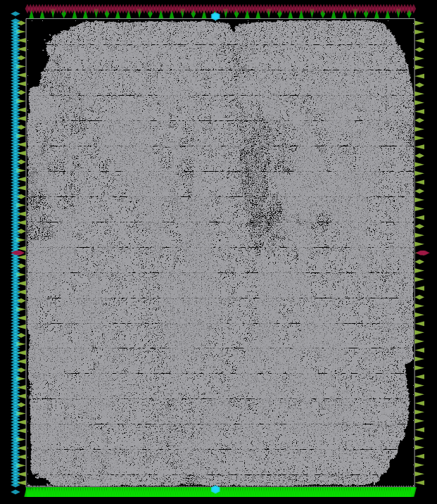

# OpenBtcMiner

Two fully pipelined SHA256 cores.

# Register map

| Name        | Address | Size | Description |
|-------------|---------|------|-------------|
| CONFIG      | 0x00    |  2:0 | Bit 0: Enable Bit 1: Use NONCE_IN Bit 2: Oneshot |
| VERSION     | 0x04    | 31:0 | |
| PREV_HASH_0 | 0x08    | 31:0 | |
| PREV_HASH_1 | 0x0C    | 31:0 | |
| PREV_HASH_2 | 0x10    | 31:0 | |
| PREV_HASH_3 | 0x14    | 31:0 | |
| PREV_HASH_4 | 0x18    | 31:0 | |
| PREV_HASH_5 | 0x1C    | 31:0 | |
| PREV_HASH_6 | 0x20    | 31:0 | |
| PREV_HASH_7 | 0x24    | 31:0 | |
| MERKLE_0    | 0x28    | 31:0 | |
| MERKLE_1    | 0x2C    | 31:0 | |
| MERKLE_2    | 0x30    | 31:0 | |
| MERKLE_3    | 0x34    | 31:0 | |
| MERKLE_4    | 0x38    | 31:0 | |
| MERKLE_5    | 0x3C    | 31:0 | |
| MERKLE_6    | 0x40    | 31:0 | |
| MERKLE_7    | 0x44    | 31:0 | |
| TIME        | 0x48    | 31:0 | |
| BITS        | 0x4C    | 31:0 | |
| NONCE_IN    | 0x50    | 31:0 | Input nonce, used for testing. Ignored if CONFIG.USE_NONCE_IN is 0.|
| STATUS      | 0x54    |  1:0 | Reading : Bit 0: Done Bit 1: Nonce found. Writing to this register will start hashing. |
| NONCE_OUT   | 0x58    | 31:0 | Output nonce |

# License

